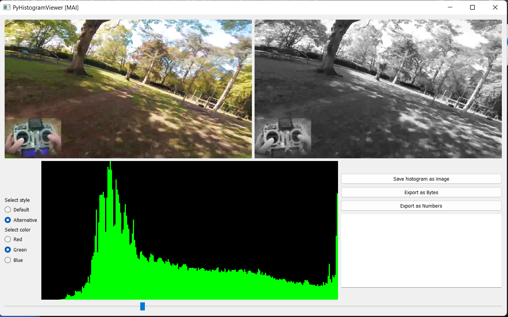

# PyHistView

PyHistView is a software used to view image histogram of the tonal distribution in video files

## Features

PyHistView has the following features:

* Multi-color histogram visualisation with two different styles
* Export of histogram and frame to file
* Export of grayscale image as file containing bytes or numbers
* Realtime view

## Installation & Documentation
1. Install Python 3.7 or above
2. Execute `pip install -r requirements.txt`
3. Run `main.py`

Input video is named `video.mp4`\
All exported files are saved to `output/`

## Contributing
Contributions are welcome and encouraged. You can contribute in many ways:

* implement a new feature;
* bug reporting & fixes;
* new feature ideas & suggestions;
* etc.